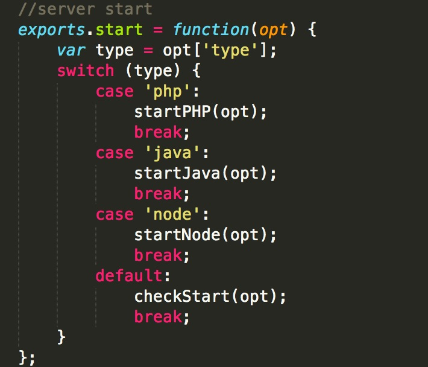

####对`fis release`流程源码添加了中文注释，想看源码的同学可以了解。

---

描述`fis release`的执行过程

使用命令查看npm安装目录：`npm config get prefix`

    建议安装`phpstorm`或者`webstorm`来调试`nodejs`代码

- 执行`fis release`

- 寻找遍历`$PATH`路径

- 进入npm/bin/fis（这个是软链接到npm/lib/node_modules/fis/bin/fis);

- `require('../fis.js').cli.run(process.argv)`

> 可以看成`require('../fis.js')`引入fis.js，

执行`fis.js`时引入核心模块`fis-kernel`模块，在此模块引入`config`，模块（这里就是我们使用`fis-conf-js`里面所用到的方法）赋值给`fis.config`对象，引入其他方法，执行定义`fis.cli.run`方法，执行该方法，

简单讲一下`require`加载机制

如果是`require('fis-kernel')`就算逐渐向上查找模块。

引入`commander`https://github.com/visionmedia/commander.js

通过commander绑定命令监听(cd /Users/zhangnan/develop/Dropbox/code/testcommander node index.js conan -s hello)

引入`fis-command-release`模块（此模块主要用于使用commander接口进行注册）

调用`fis-command-release`模块的`register`方法传入`commander`模块，register方法主要是在使用`commander`模块，
执行action传入的方法
先寻找fis-conf.js文件，
判断是否传入`live`参数，
判断`md5`，
判断`watch`,传入则调用`chokidar`模块（https://github.com/paulmillr/chokidar），
监听项目下的所有文件，时排除掉配置文件（fis-conf.js），因为监听这个文件就不可控了。

    chokidar.on('add', listener).on('change', listener).on('unlink', listener)

调用`fis-kernal`模块下面的`release.js`模块,
这里是流程的关键部分了...
首先构建文件系统(file system)

        var ret = {
        src : fis.project.getSource(), //递归获取当前目录下所有的文件，不包括`output`和`fis-conf.js`，
        //每个文件实例化一个File对象（在fis-kernal模块里面），以文件地址(例如：/common/main.js)为KEY保存一个个File对象，key保存的属性如下图。
        
        ids : {},
        pkg : {},
        //这就是map资源表了
        map : {
            res : {},
            pkg : {}
        }
    };

`File`对象里面各种路径判断都做了例如`path`替换
调用`fis-kernal`里面的'file.js'里面的`replaceProperties`里面调用了一下

    function roadmap(subpath, path, obj){
        //获取`roadmap.path`数组列表
        var map = fis.config.get('roadmap.' + path, []);
        //从第一个逐个匹配        
        for(var i = 0, len = map.length; i < len; i++){
            var opt = map[i], reg = opt.reg;
            if(reg){
                if(typeof reg === 'string'){
                    reg = fis.util.glob(replaceDefine(reg, true));
                } else if(!fis.util.is(reg, 'RegExp')){
                    fis.log.error('invalid regexp [' + reg + '] of [roadmap.' + path + '.' + i + ']');
                }
                var matches = subpath.match(reg);
                if(matches){
                    obj = obj || {};
                    //此方法如下replaceMatches，替换里面的变量`$&`或者$1等
                    replaceProperties(opt, matches, obj);
                    delete obj.reg;
                    return obj;
                }
            } else {
                fis.log.error('[roadmap.' + path + '.' + i + '] missing property [reg].');
            }
        }
        return false;
    }

    function replaceMatches(value, matches){
        return value.replace(/\$(\d+|&)/g, function(all, $1){
            return matches[$1 === '&' ? '0' : $1] || all;
        });
    }

    

之后查看`release`，下次遇到我们直接可以看代码了

    if(this.release === false){
            this.useMap = false;
            var self = this;
            Object.defineProperty(this, 'url', {
                enumerable : true,
                get : function(){
                    //这个错误可能经常看到。。因为没release
                    fis.log.error('unreleasable file [' + self.realpath + ']');
                }
            });
        } 

之后遍历`map`列表，进行单文件编译(fis-kernal/lib/compile.js)。

    function process(file){
        if(file.useParser !== false){
            pipe(file, 'parser', file.ext);
        }
        if(file.rExt){
            if(file.usePreprocessor !== false){
                pipe(file, 'preprocessor', file.rExt);
            }
            if(file.useStandard !== false){
                standard(file);
            }
            if(file.usePostprocessor !== false){
                pipe(file, 'postprocessor', file.rExt);
            }
            if(exports.settings.lint && file.useLint !== false){
                pipe(file, 'lint', file.rExt, true);
            }
            if(exports.settings.test && file.useTest !== false){
                pipe(file, 'test', file.rExt, true);
            }
            if(exports.settings.optimize && file.useOptimizer !== false){
                pipe(file, 'optimizer', file.rExt);
            }
        }
    }

然后调用`pipe`方法，获取`模块`还是`函数`
    
     //package callback
    var cb = function(packager, settings, key){
        fis.log.debug('[' + key + '] start');
        //自己写插件或者函数可以看到这个传入的参数
        packager(ret, conf, settings, opt);
        fis.log.debug('[' + key + '] end');
    };

    _.pipe = function(type, callback, def){
        //获取在config里面的module设置
        var processors = fis.config.get('modules.' + type, def);
        if(processors){
            var typeOf = typeof processors;
            //可以传入字符串
            if(typeOf === 'string'){
                processors = processors.trim().split(/\s*,\s*/);
            //也可以是function
            } else if(typeOf === 'function'){
                processors = [ processors ];
            }
            type = type.split('.')[0];
            processors.forEach(function(processor, index){
                var typeOf = typeof processor, key;
                //如果是模块就尝试获取,例如`fis-packager-map`
                if(typeOf === 'string'){
                    key = type + '.' + processor;
                    processor = fis.require(type, processor);
                } else {
                    key = type + '.' + index;
                }
                if(typeof processor === 'function'){
                    //获取参数里面的配置
                    var settings = fis.config.get('settings.' + key, {});
                    if(processor.defaultOptions){
                        settings = _.merge(processor.defaultOptions, settings);
                    }
                    //processor可能是模块，也可能是传入的函数
                    callback(processor, settings, key);
                } else {
                    fis.log.warning('invalid processor [modules.' + key + ']');
                }
            });
        }
    };

各个环节调用完成,回调这个函数`deploy`一下

           fis.release(opt, function(ret){
                process.stdout.write(
                    (opt.verbose ? '' : ' ') +
                    (Date.now() - start + 'ms').bold.green + '\n'
                );
                for(var item in collection){
                    if(collection.hasOwnProperty(item)){
                        if(opt.unique){
                            time(fis.compile.clean);
                        }
                        deploy(opt, collection);
                        deploy(opt, ret.pkg);
                        collection = {};
                        return;
                    }
                }
            });

-----

###fis用来干嘛？

说专业点是一个前端集成开发环境，官网上的内容我就不赘述了。

1.  说通俗点就是利用nodejs按要求(通过fis-conf.js配置)把`开发目录`经过一系列处理（例如合并压缩）处理成上线`发布目录`（release）的工具。

2.  当然还有一些其他功能例如本地开发服务（server）

3.  可以监听文件修改自动发布、支持less、支持模板预编译（plugin install）

4.  这里必然不全面，还有一些更牛逼的功能，这里不讲了等入门之后就可以深入了解啦。

  **以上三个已经包含了fis的三大基础命令了(fis relase、fis server、fis install)。**

###为什么要使用fis？

1、**更友好的开发方式**。把**开发**和**发布**分离，让本地开发不受线上环境的制约。本地开发时我们可以制定各种合理规范。

`模块`化是软件开发到一定复杂程度时，人们总结出来的解决方案，让开发模块更分离、更独立，模块更方便在项目中添加、使用、去除。也就是开发成packge的形式（也可以说组件化），大部分语言都有模块的概念，js不具有包的功能，但是目前来说前端项目的开发也越来越复杂，就需要这种功能了。所以大家想了各种各样的办法，比如`amd`规范针对这一大方向的产物。fis更全面解决的模块化的方案，一个个模块（模块可能包含css、js、html、template等）却不适合浏览器的加载，**fis的其中一些功能就是解决了开发目录模块化，发布时变成适合浏览器加载的方式**，这里对应的功能例如是（资源定位、嵌入资源、声明依赖）。

2、**更方便的做性能优化**。利用fis的插件功能，方面集成各种优化插件，这里的性能优化方面包括不限于：文件压缩、文件合并、自动csssprite、高效利用缓存、合理结构、合理分配请求。

3、**更高效的开发**。方便集成各种业内牛逼的工具例如本地开发服务、文件监听、自动部署、

####安装一下

fis的功能都是基于nodejs来开发的，所以用户需要安装nodejs啦:http://nodejs.org/。
安装好nodejs之后在命令行执行安装fis：

    npm install -g fis

纳尼，为什么和官网的不一样，因为官网的是基于fis的一些扩展,成为`fis-plus`，添加了推荐的配置，详细说明在这里：http://fex.baidu.com/blog/2014/03/fis-plus/

fis更详细的安装方式：https://github.com/fex-team/fis/wiki/%E5%BF%AB%E9%80%9F%E4%B8%8A%E6%89%8B

安装完了

---

###功能详解

就是自己在项目里面建立一个`fis-conf.js`的配置目录，然后在命令行里面使用`fis release`这类命令来调用各种功能。
- fis的三大基础功能就是了：
    
        fis release

        fis server    

        fis install

###三个命令

####server篇

    fis server start

这句命令就是可以说启动一个服务器模拟线上环境的，*官方说法是：它采用php-java-bridge技术实现， 依赖java、php-cgi外部环境 ，可以完美支持运行php程序哦*。

上图就是server启动函数，例如我们执行`fis server start java`这里的`type`就是`java`了，
这里我们执行的是`fis server start`所以，`swtich`到达的是`default`就会执行`checkStart`这里首先检查是否用户环境安装`java`如果没有安装就会启动`nodejs`的`server`，如果没有安装就会去检查是否安装`php-cgi`，如果`php-cgi`有安装就会启动上面说的`php-java-bridge`技术方案（支持php程序）,否则就会启动java的服务(不支持php)。

所以如果你的项目里面用到了`php`就需要安装`java`和`php-cgi`哦

java安装直接搜索一下就行了，
特别说一下，mac环境下默认安装的php是没有php-cgi的，所以可以使用*nix一键安装php-cgi的方法:

    cd ~ bash -c "$( curl http://fouber.github.io/install-php-cgi/install-php.sh -k )" -o 5.3.5

来源：https://github.com/fis-dev/install-php-cgi

server启动以后会把一个目录作为发布目录，可以使用
    
        fis server open

来打开我的电脑(window)或者finder（mac）查看这个目录发布的结果。

在浏览器里面打开`http://127.0.0.1:8080`来查看。

在你的项目里面使用命令

        fis release

默认也会把你的项目，根据当前项目文件夹的`fis-conf.js`的配置发布到这个目录下。

然后你就可以使用`http://127.0.0.1`来预览你的项目效果了。

除了`fis server start`以外还有其他命令可用，可以使用`fis server -h`来查看。

---

####release篇

    fis release 

这句命令在项目中的`fis-conf.js`同级目录中执行，意思就是把当前项目开发文件（develop folder）和文件夹发布到另一个文件夹（release folder），然后我们就可以把这个文件夹打包上线啦。

当然我们会在`fis-conf.js`进行各种配置，对文件压缩、合并、路径修改、模板预编译、md5...等等。

**我们只需要一个项目，而发布成各种各样的形式，包括不用的版本（version），beta1.0，beta2.0，甚至不同的设备端，例如无线`webapp`分成`phone`版`ipad`版，完全可以干掉所谓的`响应式设计`，使用`media query`什么的完全是鸡肋，无需浏览器判断，浏览器更无需加载其他终端的资源，完全可以在发布(`release`)时就分离开来，扯得有点远了。后面我会讲如何利用fis来做分终端的发布。**

`fis relese`

是fis核心中核心的命令。这里必须要详细的讲解，看另一篇文章详细易懂的讲解他的执行过程。

下图是fis release的执行流程图。来源：https://github.com/fex-team/fis/wiki/%E8%BF%90%E8%A1%8C%E5%8E%9F%E7%90%86

`release`总的来说过程就是读取项目下的各种文件，然后**各种处理之后**保存在另一个目录下的过程。

这个发布(`release`)过程时会处理开发中的各种文件资源。

`fis`团队为百度各个产品线提供服务，产品线前端团队会提出各种个样的需求，他们从这些需求中提炼总结出前端开发所需要的三大`语言扩展`功能（重点这里仅仅在说语言扩展），这三个功能是js、css、html这三种“开发语言”（争论css是不是开发语言不是重点）所不具备，但是随着项目复杂度越来越高而亟需的，这三个语言扩展功能给开发带了了各种方便。

> 资源定位的能力：使用开发引用路径进行资源定位，项目发布后转换成部署路径

开发时直接这样引用资源

      

发布之后图片无论被发到哪个目录，图片的src引用地址都能跟着变（当然不止图片啦，其他任何资源都可以）
            
        

> 依赖声明的能力：声明一个资源依赖另一个资源的能力

前文说过`模块化`，这里就是帮助解决模块依赖关系的。

`a模块`依赖`b模块`可以这样写（只要在`fis-conf.js`配置好，无论`a模块`和`b模块`在什么文件夹下都没关系）：

        var a = require('b')

需要说明的是这里的`require`仅仅一个作用就是让`fis`知道`a模块`依赖`b模块`，并不会把`b模块`里面的内容给嵌入进来。

> 资源嵌入的能力：把一个资源的编译内容嵌入到另一个文件中

这里的功能才是真正把直接另一个资源导入进来了，理论上可以在一个可编辑的文件可以导入另一个任何格式的文件，可以把图片导入成`base64`、可以把前端模板预编译成函数（替代浏览器的转化过程）。在`single page web application`，这个功能可以真正把`html`、`js`、`template`合并变成独立的模块来加载。
这个功能再结合打包功能（`pack`），可以实现同一功能模块，抽象公用基础部分，分离差别部分，发布成各种版本、区别化的模块，从而不同的终端或者页面中。一个模块有了极强的可移植性，又保证独立性！

`语言扩展功能`上除了这三个功能，还有其他业内已经存在的功能
例如:`less`、

- 同时可以使用各种工具，例如cssprite（自动把图片转成sprite形式）

- less等css工具集成

###详解

- project（系统配置）

> project整体配置用得比较少，默认就行了

- modules（构建流程配置）

> modules是对各个执行过程(见上图)添加插件做处理。。

- settings（插件配置）

> settings可以对各个过程插件做配置

- roadmap（目录规范与域名配置）

> roadmap是file_system（文件系统）

- pack（打包配置）

> 和pack是打包过程packager(见上图)的一个配置

- deploy（部署目标配置）

> deploy也是附加的高级功能，fis1也有，同步到测试机上

####fis有两个大的阶段，一个是单文件编译，文件彼此独立编译的过程，其实是这样的：

###获取文件目录下所有文件,实例化成一个个File文件

    var File = function(path){
    var pathinfo = fis.util.pathinfo(path);
    fis.util.merge(this, pathinfo);
    var map = fis.uri.roadmap(this.subpath);
    fis.util.merge(this, map);
    };

一个fis.File对象，先分析了一下文件路径，就有了基本的文件属性，比如

    file.ext：后缀
    file.subpath: 项目路径
    file.dirname: 所在目录
    file.basename: 文件名
    file.realpath：物理路径
    ...
    然后，用roadmap去匹配一下它的项目目录，一旦命中，就把roadmap的其他属性赋给这个file对象

各个插件工作的时候，就是靠读取file的各种属性。比如
输出文件：

    fis.deploy(file.release, file.getContent());

包装define：

    var content = 'define("' + file.id + '", ...
    file.setContent(content);

这样设计好插件之后，所有规范就在fis-conf.js中定义了，实现插件不携带规范

#####阶段一,单文件处理过程(上图右侧)
    var files = fis.project.getProjectFiles();
    files.forEach(function(file){
        fis.compile(file);
    });

这个fis.compile函数，会调用：

    parser, preprocessor, standard, postprocessor, lint, test, optimizer

这7个流程。

资源定位（修改引入地址）、内容嵌入（__inline('a.js')），依赖声明（require('a.js')）发生在这个过程

#####阶段二，打包过程(上图左侧)

    fis.util.pipe('modules.prepackager', files);
    fis.util.pipe('modules.packager', files);
    fis.util.pipe('modules.spriter', files);
    fis.util.pipe('modules.postpackager', files);

